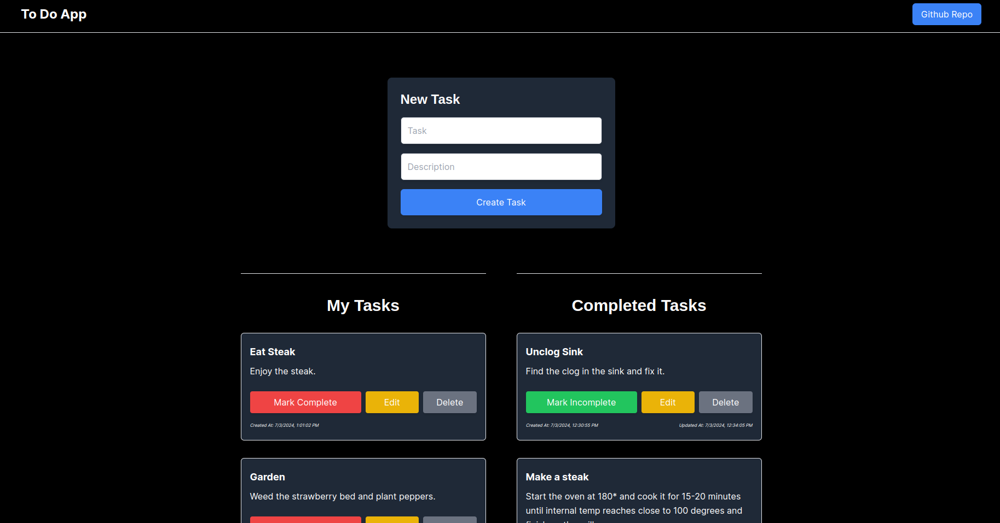

# To-Do List Application

[](LICENSE)



## Demo

Check out the live website [here](https://prisma-to-do-list.vercel.app/).

## Description

This project is a full-stack CRUD (Create, Read, Update, Delete) to-do list application built with Next.js, Node.js, TypeScript, and Prisma.

## Usage

Create tasks and stay organized.

## Features

- **Create**: Add new to-do items with titles and descriptions.
- **Read**: View the list of to-do items and their details.
- **Update**: Edit existing to-do items including title and description.
- **Delete**: Remove to-do items from the list.

## Tech Stack

- **Frontend**:
  - **Framework**: Next.js
  - **Language**: TypeScript
  - **State Management**: React Hooks
  - **Styling**: Tailwind CSS
- **Backend**:
  - **Server**: Node.js
  - **Database**: PostgreSQL (via Prisma)
  - **API**: RESTful API endpoints (handled with Next.js API routes)

## Getting Started

To run this project locally, follow these steps:

1. **Clone the repository**:

```bash
git clone  git@github.com:austinmargarone/todo-list.git
cd todo-list
```

2. **Install & Launch**:

```bash
npm install
npm run dev
```

## Contributing

We welcome contributions from the community! To contribute to the project, follow these steps:

1. Fork this repository.
2. Create a new branch (`git checkout -b feature/your-feature-name`).
3. Make your changes and commit them (`git commit -am 'Add new feature'`).
4. Push to the branch (`git push origin feature/your-feature-name`).
5. Create a new Pull Request.

Please review our [Contributing Guidelines](CONTRIBUTING.md) for more details.

## License

This project is licensed under the [MIT License](LICENSE).

## Contact

For questions or support, please contact Austin Margarone at austin@margarone.dev.
